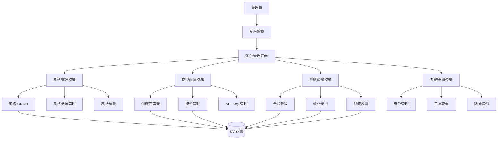
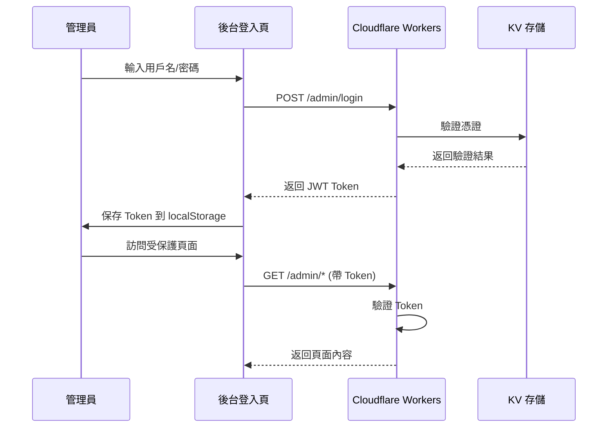
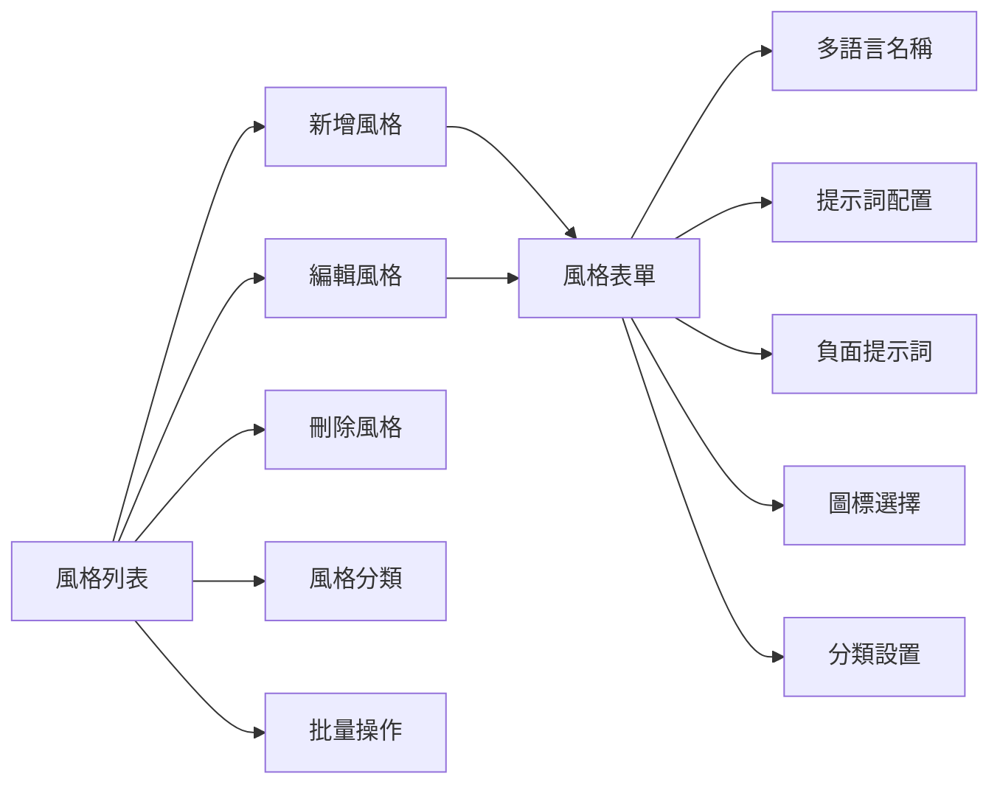
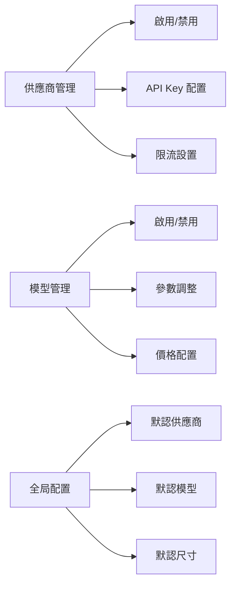
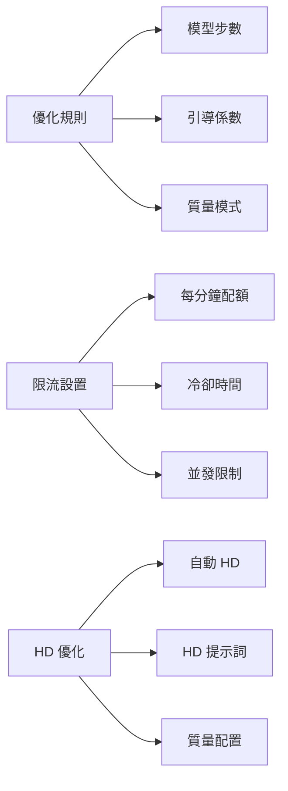

# 內容管理後台系統設計方案

## 📋 項目概述

為 Flux AI Pro 項目設計一個完整的內容管理後台系統，支持風格管理、模型配置和參數調整功能。

## 🏗️ 系統架構

### 整體架構圖



### 技術棧

- **前端**: HTML5 + CSS3 + Vanilla JavaScript
- **後端**: Cloudflare Workers
- **存儲**: Cloudflare KV
- **認證**: JWT + API Key
- **路由**: URL Pattern Matching

## 🔐 身份驗證機制

### 認證流程



### 實現細節

1. **管理員賬戶存儲**
   - KV Key: `admin:credentials`
   - 格式: `{ username: "admin", passwordHash: "sha256_hash" }`

2. **JWT Token 生成**
   - 使用 Cloudflare Workers 的 Web Crypto API
   - 有效期: 24 小時
   - 存儲位置: KV `admin:tokens:{token}`

3. **中間件驗證**
   - 所有 `/admin/*` 路由都需要驗證
   - Token 驗證失敗返回 401

## 🎨 風格管理功能

### 功能模塊



### 數據結構

```javascript
// KV Key: admin:styles
{
  "custom_styles": {
    "style_id_1": {
      "id": "style_id_1",
      "name": {
        "zh": "自定義風格",
        "en": "Custom Style",
        "ja": "カスタムスタイル",
        "ko": "커스텀 스타일",
        "ar": "نمط مخصص"
      },
      "prompt": "custom style prompt",
      "negative": "negative prompt",
      "category": "custom",
      "icon": "🎨",
      "description": {
        "zh": "風格描述",
        "en": "Style description",
        "ja": "スタイルの説明",
        "ko": "스타일 설명",
        "ar": "وصف النمط"
      },
      "enabled": true,
      "createdAt": "2024-01-01T00:00:00Z",
      "updatedAt": "2024-01-01T00:00:00Z"
    }
  },
  "style_categories": {
    "custom": {
      "name": { "zh": "自定義", "en": "Custom", "ja": "カスタム", "ko": "커스텀", "ar": "مخصص" },
      "icon": "✨"
    }
  }
}
```

### API 端點

| 方法 | 路徑 | 說明 |
|------|------|------|
| GET | `/admin/api/styles` | 獲取所有風格 |
| GET | `/admin/api/styles/:id` | 獲取單個風格 |
| POST | `/admin/api/styles` | 創建新風格 |
| PUT | `/admin/api/styles/:id` | 更新風格 |
| DELETE | `/admin/api/styles/:id` | 刪除風格 |
| GET | `/admin/api/categories` | 獲取所有分類 |
| POST | `/admin/api/categories` | 創建新分類 |

## 🤖 模型配置功能

### 功能模塊



### 數據結構

```javascript
// KV Key: admin:providers
{
  "providers": {
    "pollinations": {
      "enabled": true,
      "default": true,
      "apiKey": "",
      "rateLimit": { "requests": 60, "interval": 60 },
      "models": {
        "flux-2-dev": {
          "enabled": true,
          "default": true,
          "maxSize": { "width": 2048, "height": 2048 },
          "pricing": { "imagePrice": 0.0005, "currency": "pollen" }
        }
      }
    }
  },
  "global_settings": {
    "defaultProvider": "pollinations",
    "defaultModel": "flux-2-dev",
    "defaultSize": "square-1k"
  }
}
```

### API 端點

| 方法 | 路徑 | 說明 |
|------|------|------|
| GET | `/admin/api/providers` | 獲取所有供應商 |
| PUT | `/admin/api/providers/:id` | 更新供應商配置 |
| GET | `/admin/api/providers/:id/models` | 獲取供應商模型 |
| PUT | `/admin/api/providers/:id/models/:modelId` | 更新模型配置 |
| GET | `/admin/api/settings/global` | 獲取全局設置 |
| PUT | `/admin/api/settings/global` | 更新全局設置 |

## ⚙️ 參數調整功能

### 功能模塊



### 數據結構

```javascript
// KV Key: admin:parameters
{
  "optimization_rules": {
    "MODEL_STEPS": {
      "flux-2-dev": { "min": 20, "max": 50, "default": 30 },
      "imagen-4": { "min": 15, "max": 40, "default": 25 }
    },
    "MODEL_GUIDANCE": {
      "flux-2-dev": { "min": 5, "max": 15, "default": 7.5 },
      "imagen-4": { "min": 4, "max": 12, "default": 6 }
    }
  },
  "rate_limits": {
    "nano_pro": {
      "requestsPerMinute": 3,
      "cooldownSeconds": 20
    },
    "main": {
      "requestsPerMinute": 10,
      "cooldownSeconds": 30
    }
  },
  "hd_optimization": {
    "autoHD": true,
    "QUALITY_MODES": {
      "economy": { "steps": 20, "guidance": 6 },
      "standard": { "steps": 30, "guidance": 7.5 },
      "ultra": { "steps": 50, "guidance": 10 }
    }
  }
}
```

### API 端點

| 方法 | 路徑 | 說明 |
|------|------|------|
| GET | `/admin/api/parameters` | 獲取所有參數 |
| PUT | `/admin/api/parameters/optimization` | 更新優化規則 |
| PUT | `/admin/api/parameters/rate-limits` | 更新限流設置 |
| PUT | `/admin/api/parameters/hd-optimization` | 更新 HD 優化 |
| POST | `/admin/api/parameters/reset` | 重置為默認值 |

## 🖥️ 後台 UI 界面設計

### 頁面結構

```
/admin
├── /login              # 登入頁
├── /dashboard          # 儀表板
├── /styles             # 風格管理
│   ├── /list          # 風格列表
│   ├── /create        # 新增風格
│   └── /edit/:id      # 編輯風格
├── /providers          # 供應商管理
│   ├── /list          # 供應商列表
│   └── /edit/:id      # 編輯供應商
├── /models             # 模型管理
│   ├── /list          # 模型列表
│   └── /edit/:id      # 編編輯模型
├── /parameters         # 參數調整
│   ├── /optimization  # 優化規則
│   ├── /rate-limits   # 限流設置
│   └── /hd-optimization # HD 優化
└── /settings           # 系統設置
    ├── /global        # 全局設置
    ├── /logs          # 日誌查看
    └── /backup        # 數據備份
```

### UI 組件設計

1. **側邊導航欄**
   - 風格管理
   - 模型配置
   - 參數調整
   - 系統設置
   - 登出

2. **數據表格**
   - 支持排序
   - 支持搜索
   - 支持分頁
   - 批量操作

3. **表單組件**
   - 多語言輸入
   - 滑塊控制
   - 開關切換
   - 顏色選擇器

4. **預覽組件**
   - 風格預覽
   - 模型測試
   - 參數效果預覽

## 📡 API 端點總覽

### 認證相關

| 方法 | 路徑 | 說明 |
|------|------|------|
| POST | `/admin/api/login` | 管理員登入 |
| POST | `/admin/api/logout` | 管理員登出 |
| GET | `/admin/api/me` | 獲取當前用戶信息 |

### 風格管理

| 方法 | 路徑 | 說明 |
|------|------|------|
| GET | `/admin/api/styles` | 獲取所有風格 |
| GET | `/admin/api/styles/:id` | 獲取單個風格 |
| POST | `/admin/api/styles` | 創建新風格 |
| PUT | `/admin/api/styles/:id` | 更新風格 |
| DELETE | `/admin/api/styles/:id` | 刪除風格 |
| POST | `/admin/api/styles/batch` | 批量操作風格 |

### 模型配置

| 方法 | 路徑 | 說明 |
|------|------|------|
| GET | `/admin/api/providers` | 獲取所有供應商 |
| PUT | `/admin/api/providers/:id` | 更新供應商配置 |
| GET | `/admin/api/providers/:id/models` | 獲取供應商模型 |
| PUT | `/admin/api/providers/:id/models/:modelId` | 更新模型配置 |
| POST | `/admin/api/models/test` | 測試模型 |

### 參數調整

| 方法 | 路徑 | 說明 |
|------|------|------|
| GET | `/admin/api/parameters` | 獲取所有參數 |
| PUT | `/admin/api/parameters/optimization` | 更新優化規則 |
| PUT | `/admin/api/parameters/rate-limits` | 更新限流設置 |
| PUT | `/admin/api/parameters/hd-optimization` | 更新 HD 優化 |
| POST | `/admin/api/parameters/reset` | 重置為默認值 |

### 系統設置

| 方法 | 路徑 | 說明 |
|------|------|------|
| GET | `/admin/api/settings/global` | 獲取全局設置 |
| PUT | `/admin/api/settings/global` | 更新全局設置 |
| GET | `/admin/api/logs` | 獲取日誌 |
| POST | `/admin/api/backup` | 創建備份 |
| POST | `/admin/api/restore` | 恢復備份 |

## 🔒 安全措施

1. **身份驗證**
   - JWT Token 驗證
   - Token 過期自動登出
   - 密碼 SHA256 加密存儲

2. **權限控制**
   - 基於角色的訪問控制 (RBAC)
   - API 請求頻率限制
   - IP 白名單（可選）

3. **數據保護**
   - KV 數據加密存儲
   - 操作日誌記錄
   - 敏感操作二次確認

4. **防護措施**
   - CSRF 保護
   - XSS 防護
   - SQL 注入防護（雖然不使用 SQL）

## 📊 數據存儲設計

### KV 存儲結構

```
admin:credentials              # 管理員憑證
admin:tokens:{token}           # JWT Token
admin:styles                   # 自定義風格
admin:style_categories         # 風格分類
admin:providers                # 供應商配置
admin:parameters               # 參數配置
admin:settings:global          # 全局設置
admin:logs:{date}              # 操作日誌
admin:backup:{timestamp}       # 數據備份
```

## 🚀 實施步驟

### 第一階段：基礎架構
1. 實現身份驗證系統
2. 創建後台路由結構
3. 設計基礎 UI 組件

### 第二階段：風格管理
1. 實現風格 CRUD 功能
2. 實現風格分類管理
3. 實現風格預覽功能

### 第三階段：模型配置
1. 實現供應商管理
2. 實現模型管理
3. 實現 API Key 管理

### 第四階段：參數調整
1. 實現優化規則配置
2. 實現限流設置
3. 實現 HD 優化配置

### 第五階段：系統設置
1. 實現全局設置
2. 實現日誌查看
3. 實現數據備份/恢復

## 📝 注意事項

1. **兼容性**: 確保後台配置與現有 worker.js CONFIG 對象兼容
2. **性能**: KV 讀寫操作需要考慮延遲
3. **備份**: 重要配置變更需要備份
4. **測試**: 所有配置變更需要測試驗證
5. **日誌**: 記錄所有管理員操作以便審計
